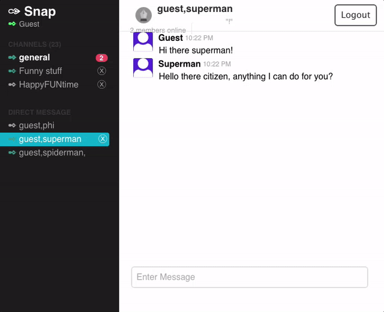
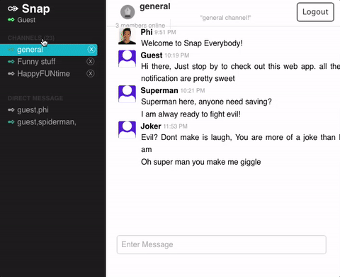
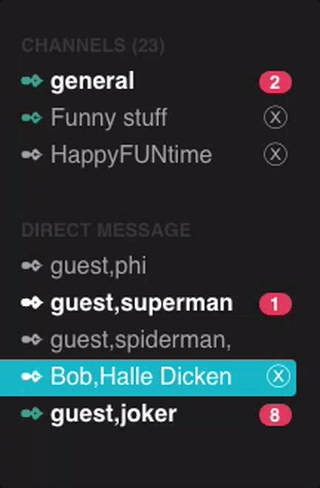
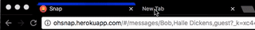
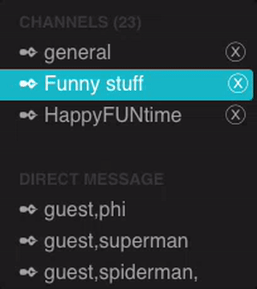

# [**Snap**](http://ohsnap.herokuapp.com)

Snap is a full-stack application inspired by Slack. utilizing Ruby on Rails on the backend, a PostgreSQL database, and React.js with a Redux architectural framework for frontend.

## **Features and Implementation**

###  **Live chat**

  Messages are updated in real time without need to re-render with use of websockets. At any given time regardless of how many different conversation users are participating in, only one instance of full-duplex communication protocol is establish for optimal efficiency. Data stored in each chat are done so using PostgreSQL database through multiple tables with use of associations for readabilities.

  

## **Channels and Direct Message**
  Users are able to join any open channels and create direct messages with one or as many other member as they please. Channels are all public, meaning that any message post here can potentially been seen by the public. Direct Message are private message that be only been seen by members included in the original creation of the group. Direct messages are routed using all the members names, which shows up in the url. It can be create using the direct messages search bar which include an tag input feature with autocompletion/suggestion and drag and drop input. If User unsubscribe from a direct message, they will automatically be resubscribe if a new message have been posted by any of the other members.

  

## **Notification**
  Snap notifies the users incase of changes relevant to them. When new messages are create in a channels that is not open on the users page, live update of the number of new messages appear on the right of the channel. Incase of user focusing on other window beside Snap and new message is post in any of the channels, user will be notified by a brief desktop popup that appears for 2 seconds with the username of the author and the message body. If user is away from the computer in this even, they can also tell if they miss new content by the brighter browser's Snap's tabs favicon.

  

  

  

## **Online Status**   
  One the left of each channels is an indicator of whether there are members of that channels/direct message online. This feature updates in real time. In each channels near the top of the page, there is also an indicator of how many member in the current chat in online, which is also a live feature.

  

## **Single Page**
  Snap is a single page app which provide everything users need in one location. This allows for quick assess to content and efficient re-rendering of relevant content.

## **Future Features**

### **Geo-location**
  Implement google map api which overlay online users in the current channels's location on a map in realtime.
